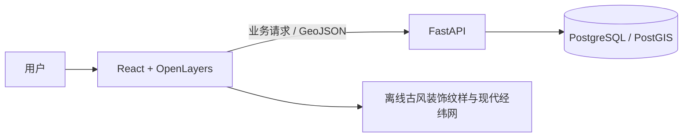

# 《山海寻踪：中国古代神话传说地图》课程报告

> 本文记录早期课程原型，涉及 FastAPI、PostGIS 与空间分析。当前在线版采用前端静态部署，功能与运行方式以根目录 README 为准；本文中的数据统计与实测结果仅对应早期版本。

## 摘要

本项目面向传统文化公众与学生，围绕《山海经》构建可在个人电脑运行的交互式 WebGIS。系统以精选故事、人物、地点及关联数据为基础，提供地图筛选、故事与地点互查、定位依据展示和空间聚集分析。项目将古籍叙事地点与现代地理对应作为有来源、有不确定性的解释记录，不把地图上的示意位置当作神话事件的历史发生地。

## 研究范围与资料方法

首版以《山海经》为核心语料，整理 24 个故事、38 个地点，覆盖山川地理、神祇、异兽、方国、神话事件五个主题。另选三条后世文献见证，收录盘古开辟、女娲造人与补天，使公众能够沿相对叙事顺序阅读创世传说与《山海经》故事；它们在数据中保留各自来源，不并入《山海经》原文。时间线表达的是阅读次序，不为神话人物或事件虚构历史年代。每条故事记录篇章、原文摘录和文本来源；地点对应作为独立候选记录，记录现代对应名、几何、可信度、说明及定位来源。

文本收录、现代地名解释和几何来源分别登记，避免把古籍原文、后世注释和现代地理判断混为同一种证据。当前精选数据为 24 个故事、38 个地点、16 个人物和 28 条来源记录。每个故事均保留篇章和短原文摘录；文本依据、现代对应解释和坐标来源分开关联。两处可映射候选为现代华山和泰山山峰点，坐标分别引用 OpenStreetMap 山峰节点；其几何表示现代峰顶，不表示古代山体边界或神话事件发生点。相关现代对应解释另引地方公开资料。昆仑、九疑相关候选保留不同说法但不赋予坐标。

地点可信度统计为较明确 2 个、存在多种说法 2 个、无法准确定位 34 个。样本数量达到计划范围；定位明确的地点比例较低，反映本项目优先记录考证依据、不以自动地理编码补点的收录规则。

核心文本入口为[中国哲学书电子化计划《山海经》](https://ctext.org/shan-hai-jing)，各条记录另指向对应篇章。华山与泰山的现代对应解释及峰顶坐标来源分开登记；坐标分别引自 [OpenStreetMap 华山节点](https://www.openstreetmap.org/node/2260053296) 和 [OpenStreetMap 泰山节点](https://www.openstreetmap.org/node/2338427466)。OpenStreetMap 坐标数据按 ODbL 使用，地图和报告需保留[来源署名与许可说明](https://www.openstreetmap.org/copyright)。现代对应解释来源列于 [数据来源说明](../data/README.md) 与地点详情。

## 系统设计

系统采用 React、TypeScript、Vite 和 OpenLayers 实现交互前端，FastAPI 提供故事、地点、统计及 GeoJSON 接口，PostgreSQL/PostGIS 保存实体、关联和空间几何。地图缩放时的屏幕点位合并由 OpenLayers 完成；空间分析由 PostGIS 执行，两者目的和尺度不同。

故事、人物、地点及来源通过关系表连接。每个地点可以没有定位候选，也可以有多个候选。地图接口只返回有几何的候选，内容接口保留全部条目。系统按相同筛选口径返回列表、地图和分析数据，避免结果之间相互矛盾。

## 空间分析方法

分析仅使用唯一、较明确的主点位候选，并排除未定位、区域范围、示意点及多候选地点；同一地点在分析中只计一次。几何从 EPSG:4326 转换至以米计量、中心位于东经 105°、北纬 35° 的方位等距投影后运行 DBSCAN，邻域距离 250 千米，最少 3 个点。当前本机数据库实测有 2 个符合纳入条件的点，少于最少点数；接口返回聚类数 0、噪声点 2。

分析描述的是典籍记载和本项目整理结果的空间分布，不代表神话事件曾在这些现代位置发生。由于样本是精选语料，聚集结果只作探索性展示，不外推为全部中国神话的空间格局。

## 实际数据与结果

五类主题的故事数分别为：山川地理 3、神祇 2、异兽 1、方国 8、神话事件 10。空间分析固定参数为 250 千米邻域和最少 3 点；实测纳入 2 个明确点位、成簇 0 个、噪声 2 个。地图背景为本地古风山水装饰纹样，不含地理坐标；故事时间线独立于坐标显示。

## 局限与后续工作

古地名与现代地名之间存在时代变迁、文献异说和研究解释差异；当前 38 个地点中大多数没有可支持的精确现代对应，DBSCAN 样本偏少且没有形成聚类。地图使用本地古风山水纹样，不绘制现代行政边界；纹样不带地理坐标，仅用于营造阅读氛围。经纬网及有依据的候选标记仍采用现代 WGS84 坐标，不能据此推断古代疆域或神话事件的发生地。现场演示无需联网加载地图瓦片。后续可扩充注释来源、提供候选说法对照，并在来源和研究范围明确后扩展到其他古代文献。

## 复现方式

项目在本机分别运行 PostgreSQL/PostGIS、FastAPI 与 Vite 前端。数据库初始化、数据导入、环境变量和服务启动步骤以项目根目录 README 为准；答辩前按干净环境启动流程验证一次，并保存实际版本与运行结果。
